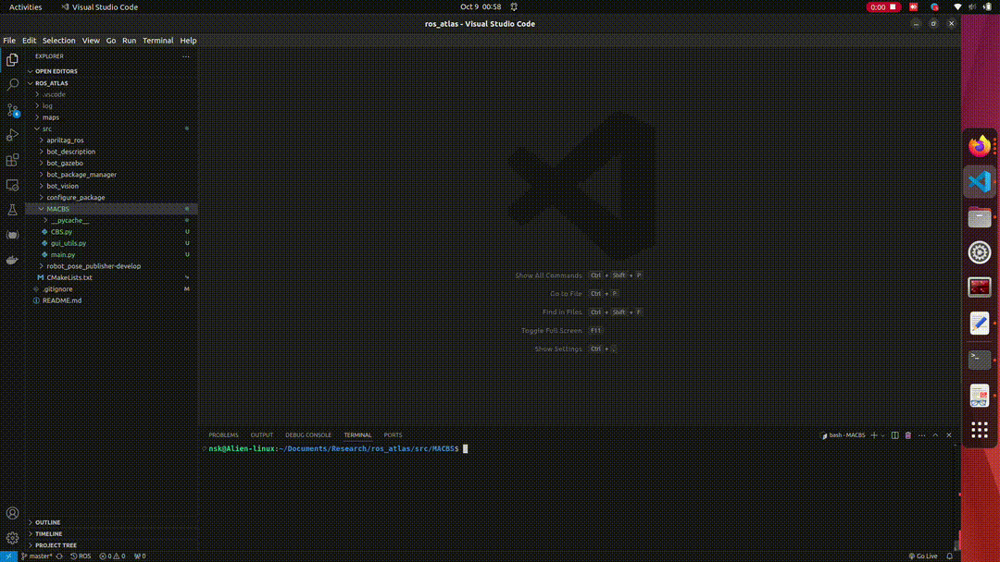

# ROS-based Robot Fleet Navigation System (In Development)

This repository contains the code developed for the **Flipkart Grid 3.0** robotics competition, where we achieved the **2nd Runner-up** position. The challenge required participants to create a package-sorting fleet management system using only a **single overhead camera** as the sole sensing element. No cameras or LiDAR sensors were allowed on the robots themselves.

## Project Status

- **Core Functionality:** The competition code is fully functional and implements a centralized fleet navigation system using **ROS** and **OpenCV**, relying solely on the overhead camera for perception.
- **Simulation:** Development is ongoing for a simulation environment using **Gazebo**.

## Getting Started

### Prerequisites

Ensure you have the following installed on your system:

- **ROS Noetic**
- **Gazebo 9**

### Installation & Setup

1. Clone the repository:
   ```bash
    git clone https://github.com/nsk-05/ros_atlas
   ```
2. Move to project folder
   ```
    cd ros_atlas
   ```
3. Launch the simulations and nodes
   ```
    roslaunch bot_gazebo grid.launch

    roslaunch bot_gazebo map_server.launch

    rosrun bot_vision goal_manager.py
   ```
4. Spawn delivery package in robot's package holder
   ```
    rosrun bot_package_manager package_spawner.py
   ```


## Multi-agent conflict based search(MACBS) visualisation

